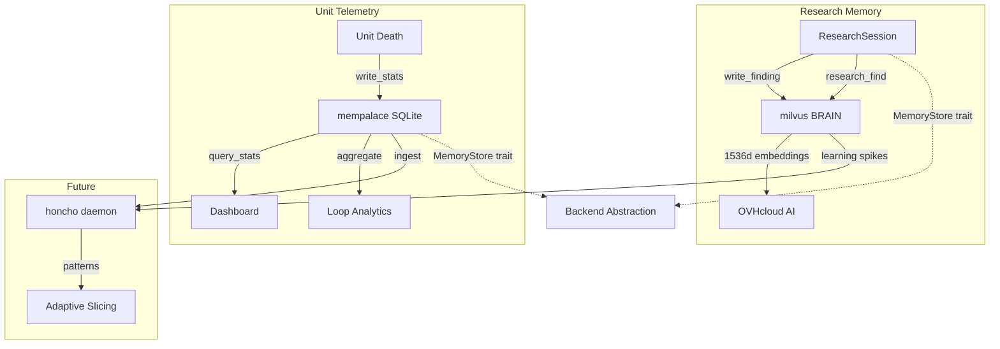

# DESIGN_BRAIN.md — Memory Architecture Summary

## Overview

Three-layer memory hierarchy for loop-engineering agent stack:

| Layer | Purpose | Backend | Access Pattern |
|-------|---------|---------|----------------|
| **milvus BRAIN** | Semantic research memory | Milvus vector DB | Vector similarity + metadata filters |
| **mempalace** | Short-term unit telemetry | SQLite (sqlx) | Key-value + aggregations |
| **honcho** | Long-term patterns | _Phase 3b_ | Time-series cross-task analysis |

## Architecture



## milvus BRAIN (Phase 2)

**Purpose:** Unified research memory for agents in research mode (deep-research, junior bursts, red-team research).

**Schema:**
- Collection: `research_findings`
- Primary key: `finding_id` (VARCHAR 64)
- Vector: `embedding` (FLOAT_VECTOR 1536d, cosine similarity)
- Scalars: `agent_id`, `topic`, `summary`, `tags` (JSON), `created_at`
- Indexes: IVF_FLAT (embeddings), inverted (scalars)

**API:**
```rust
let client = MilvusClient::connect("http://localhost:19530").await?;
client.write_finding(finding).await?;
let results = client.search(query).await?;
```

**Integration:** `ResearchSession<S: MemoryStore>` generic over backend. Wraps `Session` + memory client.

```rust
let session = ResearchSession::new("deep-research", "task-1", "milvus").await?;
session.write_finding("tokio UDS pipelining", vec!["rust".into()]).await?;
let digest = session.summarize_findings().await?;
```

**Testing:** `MockMilvusClient` with in-memory HashMap. 30 tests pass.

## mempalace (Phase 3)

**Purpose:** Short-term unit lifecycle telemetry (`/stats` on death).

**Schema:**
```sql
CREATE TABLE unit_stats (
  unit_id TEXT PRIMARY KEY,
  slice_id TEXT NOT NULL,
  loop_type TEXT NOT NULL,
  spawned_at_ms INTEGER NOT NULL,
  died_at_ms INTEGER NOT NULL,
  peak_memory_mb INTEGER,
  status TEXT CHECK(status IN ('completed', 'killed', 'failed')),
  snapshot_path TEXT
);
```

**API:**
```rust
let client = MempalaceClient::connect("mempalace.db").await?;
client.write_stats(stats).await?;
let units = client.query_stats(query).await?;
let agg = client.aggregate_by_loop_type().await?;
```

**Integration:** nushell harness writes on unit death:
```nushell
unit kill $unit_id $pid
# -> writes to mempalace.db via sqlite3 CLI
```

**Testing:** `MockMempalaceClient` + sqlx integration tests. 17 tests pass.

## MemoryStore Trait

Abstracts memory backend for `ResearchSession`:

```rust
#[async_trait]
pub trait MemoryStore {
    async fn write_finding(&self, finding: ResearchFinding) -> Result<()>;
    async fn search(&self, query: QueryBuilder) -> Result<Vec<ResearchFinding>>;
    async fn delete_finding(&self, finding_id: &str) -> Result<()>;
}
```

Implemented by:
- `MilvusClient` (production vector DB)
- `MockMilvusClient` (unit tests)
- `MempalaceClient` (optional, returns `Ok(())` for research methods)

## Key Decisions

1. **sqlx over rusqlite** — async-native, consistent with tokio runtime
2. **Generic ResearchSession** — swap backends without changing cognition layer
3. **Embedded SQLite** — no server needed for mempalace, simple deployment
4. **OVHcloud embeddings** — 1536d via `https://oai.endpoints.kepler.ai.cloud.ovh.net/v1/embeddings`
5. **Memory cap enforcement** — mempalace tracks `peak_memory_mb` for 100MB/150MB/160MB verification

## Build Status

| Component | Tests | Status |
|-----------|-------|--------|
| milvus-brain | 30 pass | ✅ Phase 2 complete |
| mempalace | 17 pass | 🟡 Phase 3 in progress (Task 4/7) |
| cognition | 16 pass | ✅ Phase 1 complete |
| loops | 30 pass | ✅ Phase 1 complete |

## Next Steps

1. Complete mempalace Task 5-7 (aggregations, nushell integration, MemoryStore trait)
2. Phase 3b: honcho daemon (reads mempalace + milvus, detects cross-task patterns)
3. Phase 4: Wave mode + yardmaster pipeline/wave selection

## Files

```
crates/milvus-brain/  # Phase 2: vector DB client
crates/mempalace/     # Phase 3: SQLite telemetry
crates/cognition/     # ResearchSession generic
docs/superpowers/
  specs/2026-06-27-phase2-milvus-brain-design.md
  specs/2026-06-27-phase3-mempalace-design.md
  plans/2026-06-27-phase3-mempalace-plan.md
```
