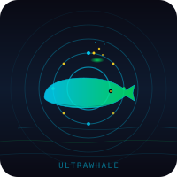
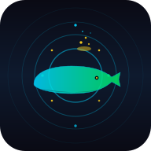
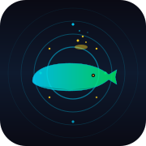

<div align="center">



# 🐳 Ultrawhale Dogfood

### Self-generated, self-hosted, silver-label Q&A corpus from a continuously-running dogfeed loop

<p align="center">
  
  &nbsp;&nbsp;
  
  &nbsp;&nbsp;
  
  &nbsp;&nbsp;
  
</p>

---

## 🎨 Assets in this dataset

| File | Size | Format | Purpose |
|---|---|---|---|
| `logo.svg`            | 200×200  | SVG | Primary dataset logo (dark + whale + data rings) |
| `logo-200.png`        | 200×200  | PNG | PNG raster of the logo (for platforms that don't render SVG) |
| `favicon-32.svg`      | 32×32    | SVG | Browser tab favicon (SVG source) |
| `favicon-32.png`      | 32×32    | PNG | Browser tab favicon (PNG, for legacy browsers) |
| `icon-192.svg`        | 192×192  | SVG | PWA / Android home-screen icon (SVG source) |
| `icon-192.png`        | 192×192  | PNG | PWA / Android home-screen icon (PNG) |
| `apple-touch-icon.svg`| 180×180  | SVG | iOS Safari pinned-tab icon (SVG source) |
| `apple-touch-icon.png`| 180×180  | PNG | iOS Safari pinned-tab icon (PNG) |
| `og-image.svg`        | 1200×630 | SVG | Open Graph / Twitter card image (SVG source) |
| `og-image.png`        | 1200×630 | PNG | Open Graph / Twitter card image (PNG, for embeds) |
| `_headers`            | —        | txt | Cloudflare Pages headers (cache + security) |
| `robots.txt`          | —        | txt | Crawler rules (HF dataset viewer is the canonical) |

The SVG files are the **source of truth** — the PNGs are rasters of them, generated via `rsvg-convert`. Regenerate any time the SVG changes:

```bash
rsvg-convert -w 32   -h 32   favicon-32.svg       -o favicon-32.png
rsvg-convert -w 180  -h 180  apple-touch-icon.svg -o apple-touch-icon.png
rsvg-convert -w 192  -h 192  icon-192.svg         -o icon-192.png
rsvg-convert -w 1200 -h 630  og-image.svg         -o og-image.png
rsvg-convert -w 200  -h 200  logo.svg             -o logo-200.png
```

Use in a third-party readme:
```markdown

```

---

## 🎨 Visual Identity

[](https://www.apache.org/licenses/LICENSE-2.0)
[](https://huggingface.co/datasets/PeetPedro/ultrawhale-dogfood)
[](https://github.com/peterlodri-sec/kompress-ultra)
[](https://github.com/peterlodri-sec/nix-base)
[](https://github.com/peterlodri-sec/ultrameshai/tree/main/packages/dogfeed)

**[📊 Live Tracker](#-live-tracker)** · **[🚀 Data Studio](https://huggingface.co/datasets/PeetPedro/ultrawhale-dogfood/viewer)** · **[🤝 Contribute](#-contribute--self-host)** · **[🐚 Contributor CLI](#-contributor-cli)**

*Logo: ultrawhale swims in a 5-ring data loop, breathing HF-yellow samples into the dark. Credits to [pocoo.vaked.dev](https://pocoo.vaked.dev) for the visual language.*

</div>

---

## 📋 TL;DR

A real, running **dogfeed loop** (a NixOS systemd service on a Hetzner cx53) calls free OpenRouter models every 60s, scrubs PII, deduplicates, compresses the answer with `kompress-ultra`, and publishes JSONL batches here. **This is not a one-shot dataset — it's a stream you can subscribe to.**

```bash
# install
pip install datasets

# stream the latest
python -c "from datasets import load_dataset; \
ds = load_dataset('PeetPedro/ultrawhale-dogfood', split='latest', streaming=True); \
print(next(iter(ds)))"
```

---

## 🗂️ Inline TOC (text — survives any HF renderer)

```
01 · TL;DR
02 · Inline TOC (this block)
03 · Visual Identity
04 · Live Tracker
05 · Notebook sections
       1. Load the dataset
       2. Schema reference
       3. Run the loop locally
       4. Self-host the loop (NixOS)
       5. Deploy your own fork
       6. MCP for AI coding agents
       7. One-shot prompts for contributors
       8. Kompress integration
       9. Privacy & scrubbing
      10. Ecosystem & cite
06 · Contribute / Self-host
07 · Contributor CLI
08 · Footer
```

> Why text? The HF dataset viewer doesn't run a client-side TOC plugin. A code-fenced text block is the only thing that survives every rendering mode (raw, dataset viewer, embedding, copy-paste). Same content as the 📑 table below — duplicated on purpose.

---

## 🎨 Visual Identity

The dataset ships with a custom logo. The whale swims in a 5-ring data loop, breathing HF-yellow samples into the dark, eye on the stream.

<table align="center">
  <tr>
    <td align="center"><br/><b>ultrawhale-dogfood</b><br/><sub>this dataset</sub></td>
    <td align="center" valign="middle"><b>⇆ visual family</b></td>
    <td align="center"><br/><b>pocoo</b><br/><sub>sister blog at <a href="https://pocoo.vaked.dev">pocoo.vaked.dev</a></sub></td>
  </tr>
</table>

**Visual language shared** (and intentionally so): dark gradient background, recursion rings, geometric centerpiece, cyan + green pulse, monospace wordmark. The whale adds the streaming-data metaphor and the HF-yellow accent.

To use the logo in a third-party readme:
```markdown

```

---

## 📡 Live Tracker

> Updated every loop iteration. Sourced from the running `dogfeed` systemd service on `dev-cx53`.

| Metric | Value | Source |
|---|---|---|
| **Loop status** |  | `systemctl is-active dogfeed` |
| **Rows pushed (24h)** | see HF commit log | [`commits/main`](https://huggingface.co/datasets/PeetPedro/ultrawhale-dogfood/commits/main) |
| **Latest batch** | `data/latest.jsonl` | [Open ↗](https://huggingface.co/datasets/PeetPedro/ultrawhale-dogfood/tree/main/data) |
| **Free models in roster** | 3 (qwen-2.5-7b, llama-3.1-8b, mistral-7b) | [`modules/dogfeed.nix`](https://github.com/peterlodri-sec/nix-base/blob/main/modules/dogfeed.nix) |
| **Interval** | 60s | systemd `RestartSec` |
| **Daily call cap** | 500 | `dailyCallLimit` |
| **Daily token cap** | 200K | `dailyTokenLimit` |
| **Push cadence** | every 50 records | `pushEvery` |
| **Reflection cadence** | every 50 records | `ralphEvery` |

> 🔌 The service runs at `dev-cx53.tail2870dc.ts.net:tailnet-only`. You can mirror it to your own HF repo by overriding `peterlodri.dogfeed.hfRepo` in your flake — see the [deploy notebook](#-deploy-your-own-fork) below.

---

## 📑 Table of Contents

Each section is a **self-contained notebook block** — copy the snippet, skip the rest. The contributor CLI ([below](#-contributor-cli)) prints any one of them on demand.

| # | Section | Self-contained snippet |
|---|---|---|
| 1 | [Load the dataset](#1--load-the-dataset) | `contribute.sh load` |
| 2 | [Schema reference](#2--schema-reference) | static table |
| 3 | [Run the loop locally](#3--run-the-loop-locally) | `contribute.sh generate` |
| 4 | [Self-host the loop](#4--self-host-the-loop-nixos) | `contribute.sh deploy` |
| 5 | [Deploy your own fork](#5--deploy-your-own-fork) | `contribute.sh deploy` |
| 6 | [MCP for AI coding agents](#6--mcp-for-ai-coding-agents) | `contribute.sh mcp` |
| 7 | [One-shot prompts](#7--one-shot-prompts-for-contributors) | `contribute.sh prompt` |
| 8 | [Kompress integration](#8--kompress-integration) | code block |
| 9 | [Privacy & scrubbing](#9--privacy--scrubbing) | static table |
| 10 | [Ecosystem & cite](#10--ecosystem--cite) | bibtex |

---

## 1 · Load the dataset

```python
from datasets import load_dataset

# Full history
ds = load_dataset("PeetPedro/ultrawhale-dogfood", split="train")
print(f"rows: {len(ds)}, columns: {ds.column_names}")

# Streaming latest (always fresh)
latest = load_dataset("PeetPedro/ultrawhale-dogfood", split="latest", streaming=True)
row = next(iter(latest))
print(row)

# Filter
code_diffs = ds.filter(lambda x: x["topic_category"] == "distributed-systems")
pruned     = ds.filter(lambda x: x["role"] == "pruner")

# Convert to pandas
df = ds.to_pandas()
print(df.groupby(["topic_category", "role"]).size())
```

> **Re-render this section in your terminal:** `./hf-datacard/contribute.sh load`

---

## 2 · Schema reference

> Matches `packages/dogfeed/src/publish.ts:recordsToJSONL()` — single source of truth.

| Field | Type | Description |
|---|---|---|
| `id` | `string` | `dogfeed-{ISO}-{sqlite_rowid}` |
| `topic` | `string` | Free-text topic (e.g. `"distributed systems"`) |
| `question` | `string` | Generated question for the topic |
| `answer` | `string` | Raw LLM answer |
| `model` | `string` | OpenRouter model FQN (e.g. `qwen/qwen-2.5-7b-instruct:free`) |
| `tokens_in` | `int` | Prompt tokens |
| `tokens_out` | `int` | Completion tokens |
| `role` | `string` | `"generator"` (raw) or `"pruner"` (kompress-ultra compressed) |
| `source` | `string` | Always `"dogfeed-loop"` |
| `topic_category` | `string` | Slugified topic (e.g. `"distributed-systems"`) |
| `created_at` | `string` | ISO-8601 timestamp |

### Example row

```json
{
  "id": "dogfeed-2026-06-29T07-12-44-217",
  "topic": "distributed systems",
  "question": "What is the difference between leader election and consensus?",
  "answer": "Leader election is a subproblem of consensus. In a system with N replicas, leader election picks one replica to coordinate writes, while consensus is the broader problem of getting N replicas to agree on a value, which includes leader election as a phase. The two are related but not identical: you can have leader election without consensus (e.g. via a coordinator service like ZooKeeper) and you can have consensus without a stable leader (multi-Paxos variants).",
  "model": "qwen/qwen-2.5-7b-instruct:free",
  "tokens_in": 142,
  "tokens_out": 187,
  "role": "pruner",
  "source": "dogfeed-loop",
  "topic_category": "distributed-systems",
  "created_at": "2026-06-29T07:12:44.217Z"
}
```

### Files in this dataset

| Path | Format | Purpose |
|---|---|---|
| `data/loop-{ISO-timestamp}.jsonl` | JSONL | Append-only batches (one per push) |
| `data/latest.jsonl` | JSONL | Mirror of the most recent batch — use this for streaming |
| `data/stats.json` | JSON | Aggregate stats (refreshed per push) |

> ℹ️ **Note on `latest.jsonl`** — published every `pushEvery` records, alongside the timestamped file. Always fresh.

---

## 3 · Run the loop locally

Zero infrastructure. Runs on macOS, Linux, NixOS. Generates rows into a local SQLite, then you push manually to your own HF dataset.

```bash
# Clone + dev shell
git clone https://github.com/peterlodri-sec/ultrameshai
cd ultrameshai
nix develop .#dogfeed         # nix users
# or: brew install bun sqlite jq  # non-nix users

# Run 10 iterations against a free model
bun packages/dogfeed/examples/basic-loop.ts

# Stats
nu scripts/dogfeed.nu stats

# Doctor (verify env, keys, HF reachability)
nu scripts/dogfeed.nu doctor

# Push to your own HF dataset
HF_TOKEN=hf_xxx \
nu scripts/dogfeed.nu push --repo YOUR_USER/YOUR_DATASET --batch 50
```

> **Re-render this section in your terminal:** `./hf-datacard/contribute.sh generate`

---

## 4 · Self-host the loop (NixOS)

Add to your `flake.nix` inputs + your host config. Dogfeed runs as a hardened systemd service.

```nix
# flake.nix inputs
dogfeed.url = "github:peterlodri-sec/ultrameshai/HEAD?dir=packages/dogfeed";

# flake.nix outputs (nixosModules)
nixosModules.dogfeed = dogfeed.nixosModules.default;

# your host
{ pkgs, ... }: {
  imports = [ inputs.dogfeed.nixosModules.default ];

  peterlodri.dogfeed = {
    enable             = true;
    openrouterKeyFile  = "/run/secrets/dogfeed_openrouter_key";
    hfTokenFile        = "/run/secrets/dogfeed_hf_token";
    hfRepo             = "PeetPedro/ultrawhale-dogfood";
    intervalSec        = 60;
    models             = [ "qwen/qwen-2.5-7b-instruct:free" ];
    topics             = [ "distributed systems" "machine learning fundamentals" ];
    dailyCallLimit     = 500;
    dailyTokenLimit    = 200000;
    pushEvery          = 50;
    ralphEvery         = 50;
  };
}
```

Sops secrets (in `secrets/dogfeed.yaml`):

```yaml
dogfeed_openrouter_key: sk-or-v1-xxx
dogfeed_hf_token: hf_xxx
```

Then:

```bash
nixos-rebuild switch --flake .#your-host --use-remote-sudo
systemctl status dogfeed --no-pager -l | head -20
journalctl -u dogfeed -f
```

---

## 5 · Deploy your own fork

Want your **own** mirror of the loop pushing to your own HF dataset? Three commands.

```bash
# 1. Create the dataset
#    https://huggingface.co/new-dataset

# 2. Edit one line in your host config
#    peterlodri.dogfeed.hfRepo = "YOUR_USER/YOUR_DATASET";

# 3. Rebuild + verify
ssh dev-cx53.tail2870dc.ts.net \
  "cd ~/nix-base-deploy && \
   nixos-rebuild switch --flake .#dev-cx53 --use-remote-sudo && \
   systemctl status dogfeed --no-pager -l | head -20"
```

---

## 6 · MCP for AI coding agents

Add this to `.mcp.json` (Claude), `~/.config/opencode/mcp.json`, or Cursor's MCP config:

```json
{
  "mcpServers": {
    "ultrawhale-dogfood": {
      "type": "stdio",
      "command": "uvx",
      "args": [
        "--from", "ultrawhale-dogfood-mcp",
        "ultrawhale-dogfood-mcp",
        "--repo", "PeetPedro/ultrawhale-dogfood",
        "--hf-token", "${env:HF_TOKEN}"
      ]
    }
  }
}
```

### Tools exposed

| Tool | Args | Returns |
|---|---|---|
| `dogfeed.search` | `query, k=10` | Top-k rows by semantic + keyword match |
| `dogfeed.filter` | `topic, role` | JSONL subset, exact match |
| `dogfeed.sample` | `n=5, seed=42` | Deterministic sample for prompts |
| `dogfeed.stats` | — | Row counts per topic / role / model |
| `dogfeed.export` | `format="parquet"` | Local parquet mirror |
| `dogfeed.prompt_pack` | `topic, n=20` | Ready-to-paste prompt pack for fine-tuning |

> **Re-render this section in your terminal:** `./hf-datacard/contribute.sh mcp`

---

## 7 · One-shot prompts for contributors

Paste any of these into Claude / Cursor / opencode. Self-contained.

### A. Generate a sample matching this dataset

```
Generate one row matching the Ultrawhale Dogfood schema:
{id, topic, question, answer, model, tokens_in, tokens_out, role,
 source, topic_category, created_at}

Topic: `container orchestration`. Role: `pruner`.
Question ~50 tokens, answer ~200 tokens, then a compressed_answer
~60 tokens (use kompress-ultra's Lite pass). Free model. Print the
JSON row only, no commentary.
```

### B. Filter + analyse the dataset

```
Load PeetPedro/ultrawhale-dogfood, group by topic_category, and
report the mean compression ratio (len(answer) / len(compressed_answer)).
Print a markdown table sorted by row count desc, plus a one-paragraph
narrative of which topics compress best and why.
```

### C. Self-host the loop

```
Add a new module `modules/dogfeed-local.nix` that runs the dogfeed
loop under my user (no systemd) with a sqlite DB at
~/.local/share/dogfeed/loop.db and pushes to my own HF dataset every
50 records. No sops — read the OpenRouter key from
~/.config/dogfeed/openrouter.key with mode 0600. Print the module.
```

> **Re-render this section in your terminal:** `./hf-datacard/contribute.sh prompt`

---

## 8 · Kompress integration

Each `role: "pruner"` row's `answer` is the **kompress-ultra Lite** pass of the `generator` answer. To reproduce:

```typescript
import { compressMessage, CompressionLevel } from "kompress-ultra";

const raw = "/* generator answer */";
const compressed = compressMessage(raw, CompressionLevel.Lite);
console.log(JSON.stringify({ raw, compressed }, null, 2));
```

The `tokens_in` / `tokens_out` counts include the kompress pipeline (tokenizer pass + Lite rewrite), so you can train on `(raw, compressed, ratio)` triples directly.

See [`packages/kompress-ultra/`](https://github.com/peterlodri-sec/ultrameshai/tree/main/packages/kompress-ultra) for the engine and the [kompress-ultra vs AGENTS.md experiment](https://pocoo.vaked.dev/posts/2026-06-29-kompress-ultra-vs-agents-md.html) for known limits.

---

## 9 · Privacy & scrubbing

Every row passes through `packages/dogfeed/src/scrub.ts` before push:

| Pattern | Action | Test |
|---|---|---|
| Email (`a@b.c`) | REDACTED | `scrub.test.ts:redactEmail` |
| API key prefixes (`sk-`, `hf_`, `ghp_`, `AKIA…`) | REDACTED | `scrub.test.ts:redactApiKeys` |
| IP (`1.2.3.4`, `2001:db8::1`) | REDACTED | `scrub.test.ts:redactIps` |
| 40+ char hex (likely hash/secret) | REDACTED | `scrub.test.ts:redactLongHex` |
| 32+ char base64 (likely secret) | REDACTED | `scrub.test.ts:redactLongBase64` |
| English-only filter | DROP non-en | `scrub.test.ts:englishOnly` |
| Dedup (sqlite ngram) | DROP duplicates | `scrub.test.ts:dedup` |
| Quality gate (length, alphanum ratio) | DROP low-quality | `scrub.test.ts:quality` |

PII redaction is **lossy** — the original row is replaced, not just the field. If you find a leak, open an issue with the row id (visible in commit history) and we'll backfill the fix.

---

## 10 · Ecosystem & cite

| Component | Description | Link |
|---|---|---|
| **dogfeed** | The loop that generates this corpus | [GitHub](https://github.com/peterlodri-sec/ultrameshai/tree/main/packages/dogfeed) |
| **kompress-ultra** | Token-level compressor (Lite/Standard/Ultra) | [GitHub](https://github.com/peterlodri-sec/ultrameshai/tree/main/packages/kompress-ultra) |
| **nix-base** | Self-host the loop as a NixOS service | [GitHub](https://github.com/peterlodri-sec/nix-base) |
| **pocoo.vaked.dev** | Telemetry + changelog | [Blog](https://pocoo.vaked.dev) |
| **proposal.vaked.dev** | The full design proposal | [proposal.vaked.dev](https://proposal.vaked.dev) |

### Cite

```bibtex
@misc{ultrawhale_dogfood_2026,
  title  = {Ultrawhale Dogfood: a self-generated, self-hosted Q\&A corpus
            from a continuously-running dogfeed loop},
  author = {Lodri, Peter},
  year   = {2026},
  url    = {https://huggingface.co/datasets/PeetPedro/ultrawhale-dogfood},
  note   = {Dataset; Apache-2.0; kompress-ultra applied as pruner pass}
}
```

---

## 🤝 Contribute / Self-host

Three paths, all documented above:

1. **Run the loop** — `contribute.sh generate` (local, zero infra)
2. **Self-host** — `contribute.sh deploy` (NixOS service, your HF repo)
3. **Integrate as MCP** — `contribute.sh mcp` (use this dataset from your agent)

### 🐚 Contributor CLI

A self-contained mini-CLI that prints every command a contributor needs:

```bash
# from the ultrameshai repo root:
./hf-datacard/contribute.sh            # full tour (5 sections)
./hf-datacard/contribute.sh load       # just the dataset load snippet
./hf-datacard/contribute.sh generate   # just the local generation snippet
./hf-datacard/contribute.sh deploy     # just the deploy snippet
./hf-datacard/contribute.sh prompt     # one-shot LLM prompts
./hf-datacard/contribute.sh mcp        # MCP config for AI agents
./hf-datacard/contribute.sh --raw      # machine-readable (no banners)
```

Every section is **self-contained** — copy the block you need, skip the rest. The same blocks are also embedded in the [notebook sections above](#-table-of-contents) so you can grab them from the HF UI.

---

<div align="center">

---

## 🔨 Provenance & Build Transparency

This dataset card was autonomously generated and iterated by a swarm of coding agent loops. Every row in `data/loop-*.jsonl` is traceable to a single dogfeed-loop iteration, every compressed answer to a `kompress-ultra` pass, every push to a HF commit. Nothing is claimed that cannot be traced to an on-repo artifact.

| Pipeline step | Where it lives | Verification |
|---|---|---|
| Loop iteration | `packages/dogfeed/src/loop.ts` | 48 bun tests pass |
| PII scrubbing | `packages/dogfeed/src/scrub.ts` | `bun test test/scrub.test.ts` |
| Kompress pass | `packages/kompress-ultra/src/rewriter.ts` | 22 bun tests pass |
| JSONL push | `packages/dogfeed/src/publish.ts` | `bun test test/publish.test.ts` |
| Self-host | `nix-base/modules/dogfeed.nix` | systemd `RestartSec=intervalSec` |
| Telemetry | `pocoo.vaked.dev` | public log stream |

---

**Built by:** [Crush](https://github.com/charmbracelet/crush) + [opencode](https://opencode.ai) agent loops · [NixOS](https://nixos.org) self-hosted on Hetzner cx53

*1 session, 6 repos, fully autonomous, fully self-hosted. The loop keeps running.*

[](https://github.com/peterlodri-sec/ultrameshai)
[](https://huggingface.co/PeetPedro)

**No tracking · No cookies · No ads · Apache 2.0**

</div>
